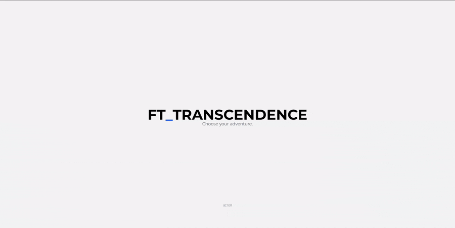
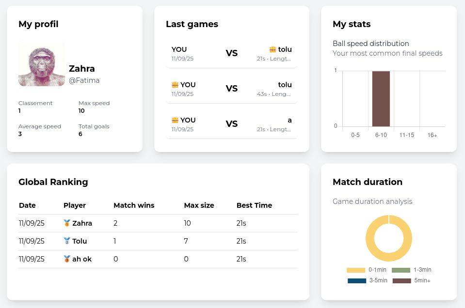
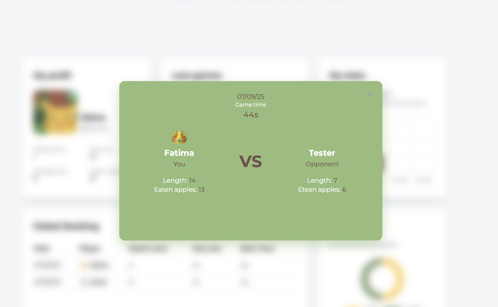
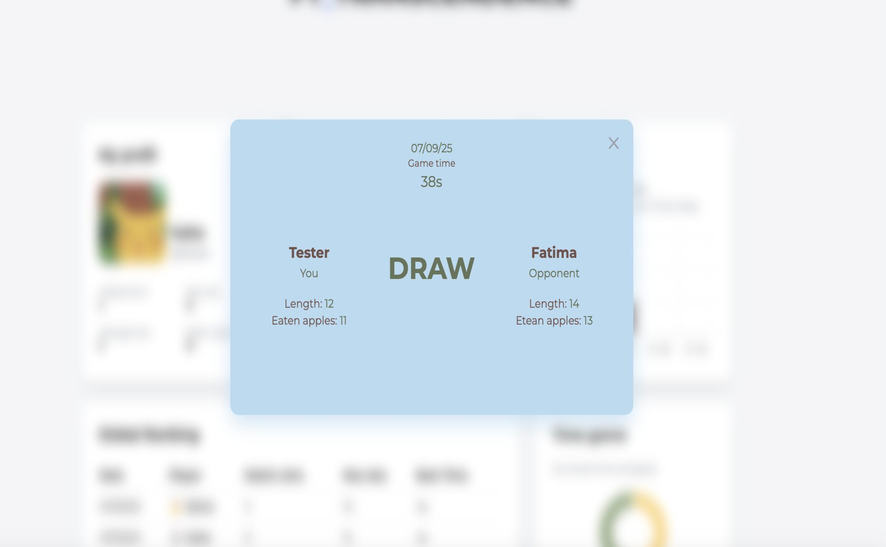
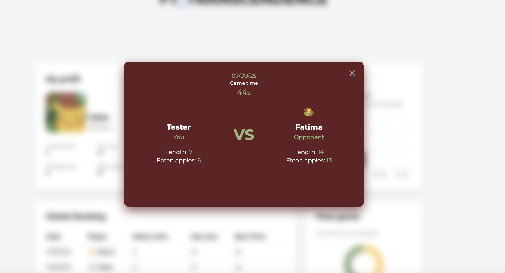

<h1 align="center">
 ✨ Welcome to Transcendence ✨
</h1>
<p align="center">
  Challenge your friends in <b>real-time matches</b>, track your progress, and <b>climb the leaderboard in this reimagined classic</b> arcade experience.</p>

<p align="center">
  
</p>

## 🎯 Project Overview

Transcendence is a real-time multiplayer Pong game built as the final project of the 42 School common core. This single-page application combines modern web technologies with classic arcade gameplay, featuring tournaments, live chat, and comprehensive user management.

## 🏗️ Architecture

**Frontend:** TypeScript + Tailwind CSS  
**Backend:** Fastify (Node.js)  
**Deployment:** Docker (single command deployment)  
**Database:** PostgreSQL with hashed passwords  
**Security:** HTTPS/WSS connections throughout

## ✨ Core Features

### 🎮 Game Mechanics
- **Real-time Multiplayer:** Play Pong against other players with smooth, responsive controls
- **Tournament System:** Automated matchmaking with clear bracket visualization
- **Player Registration:** Alias-based system for tournament participation
- **Match Scheduling:** Automated notification system for upcoming games

### 🔐 Authentication & Security
- **OAuth 2.0:** Secure authentication via GitHub
- **Two-Factor Authentication (2FA):** Additional security layer with one-time codes
- **JWT Tokens:** Secure session management and API route protection
- **Form Validation:** Server-side input validation for all user interactions

### 💬 Live Chat System
- **Direct Messaging:** Send private messages to other players
- **User Blocking:** Control who can message you
- **Game Invitations:** Challenge players directly from chat
- **Tournament Notifications:** Automatic alerts for upcoming matches
- **Profile Access:** View player stats and info through chat interface

### 📊 Statistics & Analytics
- **User Dashboards:** Personal gaming statistics and performance metrics
- **Game History:** Detailed match records and outcomes
- **Data Visualization:** Charts and graphs for clear insights
- **Performance Tracking:** Monitor your progress over time

<p>
  
  
  
  
</p>

### 🔧 Monitoring & Operations
- **Prometheus:** Real-time metrics collection and system health monitoring
- **Grafana:** Custom dashboards for performance visualization
- **Alert System:** Proactive issue detection and notifications
- **Historical Data:** Long-term metric storage and analysis

### 🌍 Internationalization
- **Multi-language Support:** Available in 3+ languages
- **Seamless Switching:** Easy language selection for global accessibility

## 🚀 Quick Start
```bash
make
```

<p>
  Access the application at <code>https://localhost:8080</code>
</p>
<p>
  <em><b>Make sure Docker is installed and running on your system before launching the application.</b></em>
</p>
